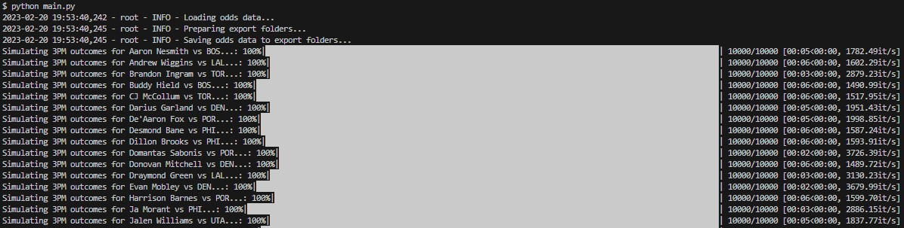

# NBA / Python betting challenge
This is the source code for an NBA player prop model. Regular updates on my twitter account <a target="_blank" href="https://www.twitter.com/bendominguez011">@bendominguez011</a>

A writeup for the reasoning behind each of these models will be located here (eventually).

## File Structure

```
exports/
    player_props/
    sim_results/
spreadsheets/
logs/
    model.log
notebooks/
model/
    models/
        threes.py
    odds_api/
        __init__.py
        config.py
    utils/
        betting_math.py
    __init__.py
    nba_api_helpers.py
config.py
main.py
```

## Project Requirements:

You'll need to install `nba.api` seperately, and when you do, use the command:

`pip install nba.api --no-deps`

Python version: <= 3.10.5
Numpy version:  <= 1.21.5

To install Python dependencies:
`
pip install -r requirements.txt
`

### Environment variables
There's a couple environment variables that need to be set to be able to run the program. 
#### The Odds API
`ODDS_API_KEY`: Can retrieve your API key from this website here: https://the-odds-api.com/. There is a free version of the API, but it is limited to 500 requests/month. 

`DEBUG`: Should be set to 1 or 0. Controls logging output.

## Running the model

So far we have a three point model which is located under model/models/threes.py

To import all of the data at the same time and run the threes model, use the main.py file after setting your environment variables and installing dependencies:

```python main.py```

### Options:
```bash
    -n, --n-simulated-games           Number of games to simulate / simulation. Suggested to set to 50,000 to 200,000.
    -b, --bootstrap_samples           Number of bootstrap resamples to use in simulations. Suggested to just use 100_000 unless you really want to change it.
```



Alternatively, you could also run each of the models seperately, and simply import them from the `model.models` module.

